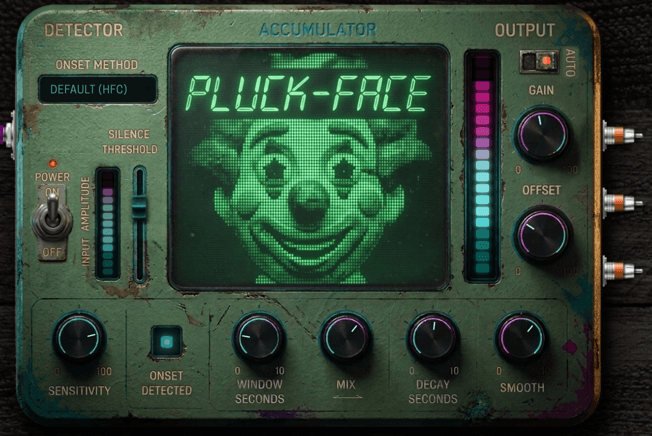

Pluckface - Onset Rate Detector
============

Pluckface senses how fast you are playing notes, and outputs a control voltage you can use to modulate other effects.



It gives visual feedback to help you adjust the sensing and output to suit your playing, and has an auto range option.  It outputs a smoothed pluck rate, an inverted version of that, and a trigger for each pluck.

You can adjust a mixture of methods for counting the plucks, to get slow moving averages or fast envelope-like decays.

*And an annoying face blinks when you pluck.*

CV out 1: positive moving count (0-1V)

CV out 2: same signal, inverted so 0-1V -> 1-0V

CV out 3 trigger on each onset

The project was initially hacked from an Aubio Harmonizer LV2 plugin by Daniel Sheeler: https://github.com/dsheeler/harmonizer.lv2
It builds using an included local copy of the Aubio library: https://github.com/aubio/aubio


Install
-------

If you are installing in a Mod device, use their http://builder.mod.audio/buildroot and load mk-for-mod-plugin-builder/pluckface.mk.

This works for me on MacOs Sonoma, tested with Mod Desktop App:
```bash
  git clone https://github.com/sensorium/pluckface.git
  cd pluckface
  make MOD=1 AUBIO_MODE=vendored sync-local-bundle
  sudo cp -r pluckface.lv2 /Library/Audio/Plug-Ins/LV2 
```


Usage Guide
-----------

On the left is a VU meter so you can adjust your input level to a good range and the Silence Threshold relates directly to the meter.  The big meter on the right is the CV output level, so you can adjust CV output Gain and Offset to match the output range (or let the Auto function take care of it).

You can mix two ways of counting plucks: a count over some previous seconds, and a "leaky integrator" where plucks pile up and decay.  

| Control         | Function  |
| --------------- | --------- |
| Onset Method    | Choose Aubio library onset detection method |
| Silence Threshold | Any audio below this level will not trigger onsets |
| Sensitivity     | Onset detection algorithm sensitivity |
| Window Seconds  | The length of the moving time window used to count plucks |
| Mix             | Mix between Window and Integrator totals |
| Decay Seconds   | How long a pluck takes to decay.  Short values are like an envelope follower |
| Smooth          | Smooth the output CV |
| Auto            | Enables auto-normalisation of the CV output to use full available range.  When Auto is toggled off, red markers show on the Gain and Offset controls to show Auto's calculated settings in case you want to match them. |
| Gain            | CV output gain |
| Offset          | CV output offset |
